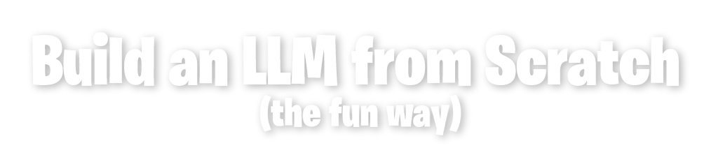

Public companion to the book by Martin Bustos Roman.

 

This repository holds the material the book points you to: quest code, chapter scripts and other public extras. The chapters themselves stay in the book.

You start from zero Python and finish with a model trained on real Steam game games, one that invents original video game ideas.

## What's here

| Path | Contents |
| --- | --- |
| `code/` | Quest solutions and chapter scripts |
